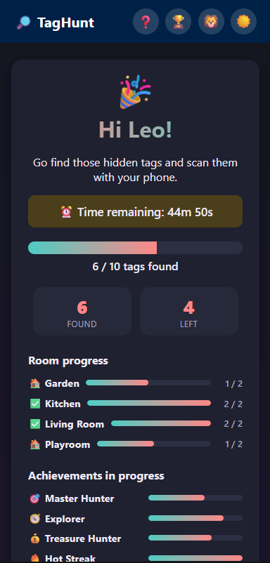
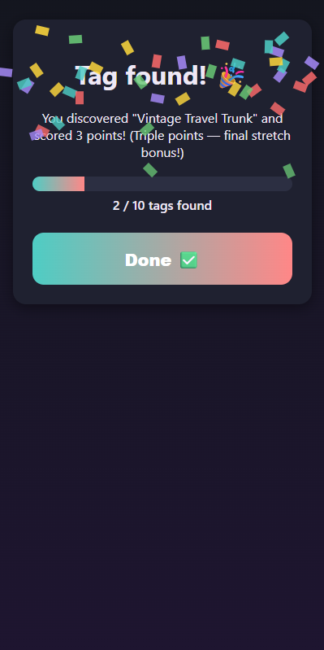
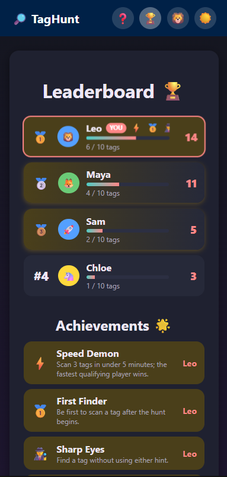
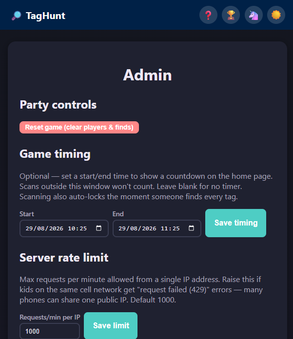

# TagHunt 🔎

A kids' NFC scavenger hunt with a live leaderboard. Hide NFC tags around the
house, kids scan them with their phone, and a single-page app tracks who's
found what.

This game is only intended for self-hosted fun

## Screenshots

| Player Home & Room Progress | NFC Tag Scanned |
| :---: | :---: |
|  |  |
| *Track overall finds, active room progress, in-progress achievements & clues* | *Instant confetti reward, point scoring & gold tag bonuses* |

| Live Leaderboard | Admin Management |
| :---: | :---: |
|  |  |
| *Real-time player scores, find progress & achievement badges* | *Manage hunt timers, configure rooms & generate NFC tag URLs* |

## How it works

- Each NFC tag is programmed with a URL like `https://taghunt.domain-name.com/t/<tagId>`.
- Scanning a tag opens the site, records the find for that kid, and shows their
  progress.
- `/leaderboard` shows everyone's score, live (polls every few seconds).
- `/admin` (protected by an admin key) lets you create tags and see the exact
  URL to write to each physical tag, and manage players.

## Local development

```powershell
# Terminal 1 - backend (serves the API on :3000)
cd backend
npm install
$env:ADMIN_KEY = "local-dev-only-change-me"
npm run dev

# Terminal 2 - frontend (dev server on :5173, proxies /api to :3000)
cd frontend
npm install
npm run dev
```

Visit http://localhost:5173, and http://localhost:5173/admin with admin key
`dev-secret`.

## Deploying with Docker

1. Copy `.env.example` to `.env` and set a strong `TAGHUNT_ADMIN_KEY`.
2. Build and run:

   ```powershell
   docker compose up -d --build
   ```

3. The app listens on port 3000 inside the container. Put it behind your
   existing reverse proxy (nginx, Caddy, Traefik, etc.) so
   `taghunt.domain-name.com` terminates HTTPS and forwards to
   `http://<host>:3000`. Since this will be reachable from the internet during
   the party, **always serve it over HTTPS** — NFC scans and the admin key
   should never go over plain HTTP.
4. Game data (players, tags, finds) lives in the `taghunt-data` Docker volume
   as a SQLite file, so it survives restarts/upgrades.

## Setting up tags

1. Go to `https://taghunt.domain-name.com/admin`, enter your admin key.
2. Add a tag for each hiding spot (e.g. "Kitchen Cupboard"). Each gets a
   unique URL like `https://taghunt.domain-name.com/t/ab12cd34`.
3. Write that exact URL to an NFC tag using any NFC-writing app (e.g. NFC
   Tools on Android/iOS), then hide the tag at that spot.
4. Kids open the site once, enter their name, then just scan tags with their
   phone's camera/NFC reader — no app install needed on most modern phones
   (NFC tags with a URL trigger an "Open in browser" prompt automatically).
5. I used these tags https://www.amazon.co.uk/dp/B077TBGQ7P

## Notes on security

- The admin key is required for all `/api/admin/*` routes and is never
  exposed to regular players.
- No accounts, passwords or email addresses are required. Players should use
  a nickname rather than their real name. Player identity is represented by a random,
  unguessable token stored in the browser.
- Rate limiting is applied to the API to reduce abuse risk since the app can be
  internet-facing during the party.

